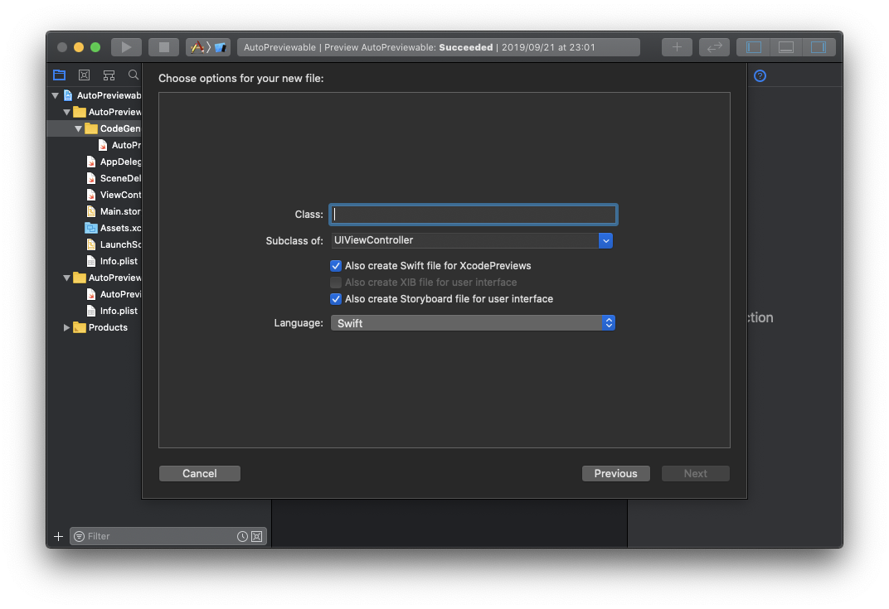

<div align="center">

<h1>XcodePreviewsTemplate</h1>
</div>

# Summary
This template generates source code corresponding to XcodePreviews.
This was conceived to introduce [StoryboardPreviewsBySwiftUI](https://github.com/AkkeyLab/StoryboardPreviewsBySwiftUI) efficiently.

# Usage
To get started please run:
```sh
./install-xcode-template.sh
```

In Xcode, select 'New File...' to use AkkeyLab templates.  
This template supports UIView and UIViewController. You can optionally set the presence of XcodePreviews and UI file (XIB / Storyboard).

|SubClass         |XcodePreviews |XIB      |Storyboard |
|---              |:-:           |:-:      |:-:        |
|UIView           |optional      |optional |×          |
|UIViewController |optional      |×        |optional   |

# License
AutoPreviewable is available under the MIT license. See the LICENSE file for more info.
